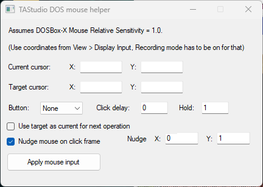

# TAStudio DOSBox Mouse Helper

Lua script for creating precise DOSBox-X relative mouse movement and click inputs in TAStudio, compatible with [Chimera](https://github.com/ToolAssisted-run/chimera/) and [BizHawk](https://github.com/TASEmulators/BizHawk/).

## Why this helper exists

Mouse input with DOSBox-X is less straightforward than it may initially appear. The `mpX` and `mpY` values in TAStudio are not the Windows cursor position. Instead, they are absolute host-axis states which, when DOSBox-X uses relative mouse input, effectively act as carriers for relative guest mouse movement.

The helper takes a current guest cursor position and a desired target position, converts that displacement into the required relative movement, and generates the corresponding TAStudio input sequence automatically. In practice, all you need to determine are the current and target cursor positions. Enable Recording mode in TAStudio, open `View > Display Input`, and move the mouse over the emulator window to read the coordinates from the overlay.

## Requirements

DOSBox-X Mouse Relative Sensitivity must be set to `1.0`. This can be configured when creating the project, or changed afterward:

- **Chimera:** open the `.chimeraProject` file in a text editor and set `"mouseSensitivity"` to `1`.
- **BizHawk:** open the `.tasproj` file with 7-Zip or a similar archive tool and set `"MouseSensitivity"` to `1.0`.

## Demo

To see a demo video, click on the following image:

## How to use

1. Download [`tastudio_dosbox_mouse_helper.lua`](tastudio_dosbox_mouse_helper.lua).
2. Open Chimera or BizHawk, as well as TAStudio and the emulator's Lua console.
3. Load the script.
4. Enter the current cursor position and the desired target position.
5. Configure the optional click settings.
6. In TAStudio, left-click the frame the movement should be applied to.
7. Click **Apply mouse input**.

The generated mouse input is written directly into TAStudio. Beware that, after the input movement, the helper restores the mouse carrier to its neutral TAStudio position (`mpX=1280`, `mpY=1024`) when necessary. Restoring the carrier keeps later mouse operations predictable and avoids unintended relative movement.

## UI

- *Current cursor:* The cursor position immediately before the selected TAStudio frame
- *Target cursor:* The cursor position that should be reached
- *Button:* Selects an optional mouse button to press after moving. Use `None` if only movement should be generated
- *Click delay:* Number of frames to wait after reaching the target before pressing the selected mouse button. A value of `0` allows the final frame of movement to also be the click frame where possible
- *Hold:* Number of frames for which the selected mouse button remains pressed
- *Use target as current for next operation:* After applying an operation, copies the target coordinates into the *Current cursor* fields
- *Nudge mouse on click frame:* Optionally applies a small movement on the click frame, specified using the X/Y fields to the right. This can be useful for games that require movement on the same frame for a click to register

## Mouse movement limits

There are two ways the generated input can produce relative movement:

- position-derived movement through `mpX` / `mpY`
- explicit relative movement through `msX` / `msY`

Position-derived movement is limited to ±255 per axis per frame, while explicit mouse speed is limited to ±180 per axis per frame. For larger movements, the helper automatically splits the movement across multiple frames. When useful, it can also use explicit mouse speed while moving the otherwise-irrelevant absolute carrier toward the opposite side. This effectively re-arms the carrier for further position-derived movement without requiring an additional idle frame.

## AI assistance

Parts of this project were developed with assistance from ChatGPT. I reviewed and tested the resulting code and take responsibility for the final implementation.

## License

MIT
